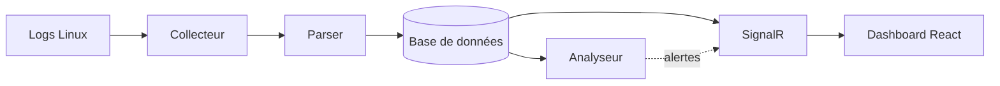

# 🛡️ NetworkLogAnalyzer

Analyseur de logs réseau en temps réel pour Linux.
Collecte les événements réseau, détecte les anomalies et les affiche
dans un dashboard interactif.

---

## Aperçu



---

## Fonctionnalités

- 📡 Collecte en temps réel via `journalctl`, `iptables`, `SharpPcap`
- 🔍 Parsing automatique des formats de logs Linux
- 🗄️ Stockage structuré dans SQLite (dev) ou PostgreSQL (prod)
- 🚨 Détection d'anomalies : port scan, flood, connexions suspectes
- 📊 Dashboard React avec graphes et tableau en temps réel
- ⚡ Push instantané via SignalR (WebSocket)

---

## Stack technique

| Côté       | Technologie              |
|------------|--------------------------|
| Backend    | ASP.NET Core 9 (C#)      |
| Frontend   | React 18 + Vite          |
| Base de données | SQLite → PostgreSQL |
| ORM        | Entity Framework Core 9  |
| Temps réel | SignalR                  |
| Graphes    | Recharts                 |

---

## Prérequis

- [.NET 9 SDK](https://dotnet.microsoft.com/download/dotnet/9.0)
- [Node.js 20+](https://nodejs.org/)
- Linux (testé sur Arch Linux / EndeavourOS)

---

## Installation

### 1. Cloner le projet

```bash
git clone https://github.com/ton-user/NetworkLogAnalyzer.git
cd NetworkLogAnalyzer
```

### 2. Backend

```bash
cd backend
dotnet restore
dotnet ef database update \
  --project src/Storage \
  --startup-project src/Api
dotnet run --project src/Api
```

Le backend démarre sur `http://localhost:5000`
La documentation Swagger est disponible sur `http://localhost:5000/swagger`

### 3. Frontend

```bash
cd frontend
npm install
npm run dev
```

Le frontend démarre sur `http://localhost:5173`

---

## Utilisation

### Lancer les deux en développement

**Terminal 1 — Backend :**
```bash
cd backend && dotnet run --project src/Api
```

**Terminal 2 — Frontend :**
```bash
cd frontend && npm run dev
```

Ouvre `http://localhost:5173` dans ton navigateur.

### Permissions réseau (capture de paquets)

Pour capturer les paquets sans être root :
```bash
sudo setcap cap_net_raw+eip $(which dotnet)
```

Ou lancer directement avec sudo :
```bash
sudo dotnet run --project src/Api
```

---

## Structure du projet
NetworkLogAnalyzer/
├── README.md
├── ARCHITECTURE.md          ← Guide technique complet
├── backend/
│   ├── global.json          ← Force .NET 9
│   ├── NetworkLogAnalyzer.sln
│   └── src/
│       ├── Api/             ← Point d'entrée HTTP + SignalR
│       ├── Collector/       ← Lecture des logs
│       ├── Parser/          ← Traduction texte brut → objets
│       ├── Storage/         ← Base de données (EF Core)
│       └── Analyzer/        ← Détection d'anomalies
└── frontend/
└── src/
├── components/      ← Tableau, graphes, alertes
├── hooks/           ← useSignalR, useEvents
└── services/        ← Appels API REST
---

## API REST
| Méthode | Endpoint                  | Description                        |
|---------|---------------------------|------------------------------------|
| GET     | `/api/events`             | Liste tous les événements          |
| GET     | `/api/events?severity=CRITICAL` | Filtrer par sévérité         |
| GET     | `/api/events?sourceIp=X`  | Filtrer par IP source              |
| GET     | `/api/events/{id}`        | Détail d'un événement              |
| GET     | `/api/events/stats`       | Statistiques globales              |

### WebSocket SignalR
ws://localhost:5000/hubs/logs
Événements reçus en temps réel :
- `NewEvent` → nouvel événement réseau
- `NewAlert` → anomalie détectée

---

## Détection d'anomalies

| Règle        | Condition                                        | Sévérité |
|--------------|--------------------------------------------------|----------|
| Port scan    | Même IP, plus de 20 ports différents en 10 sec   | CRITICAL |
| Flood        | Plus de 1000 paquets par seconde                 | CRITICAL |
| SSH bruteforce | Plus de 5 tentatives SSH échouées en 1 min    | WARNING  |

---

## Contribuer

1. Fork le projet
2. Crée une branche : `git checkout -b feature/ma-fonctionnalite`
3. Commit : `git commit -m "Ajoute ma fonctionnalité"`
4. Push : `git push origin feature/ma-fonctionnalite`
5. Ouvre une Pull Request

---

## Licence

MIT — libre d'utilisation, modification et distribution.
